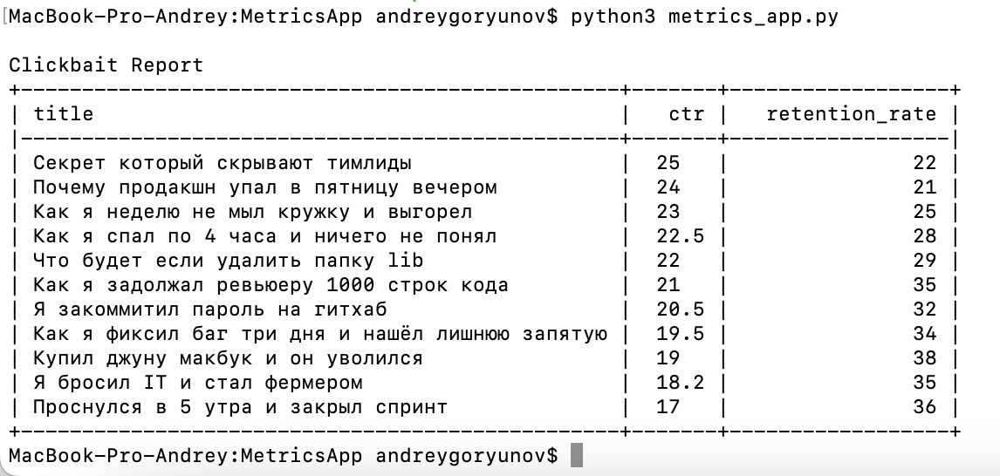
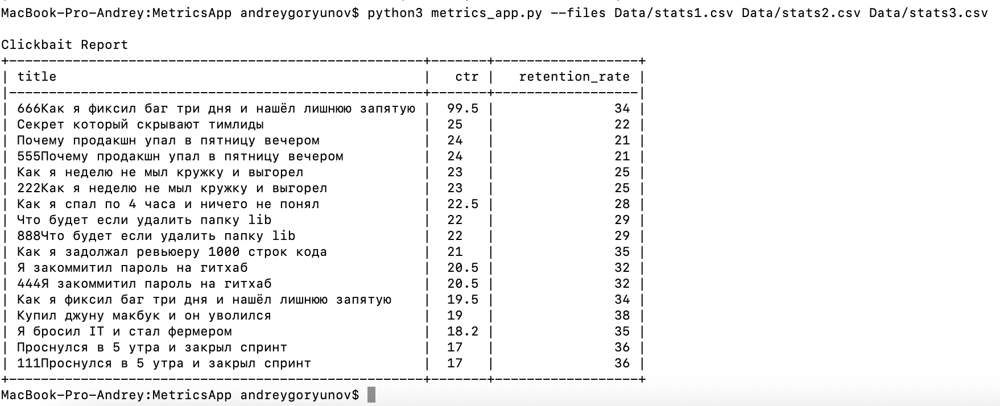
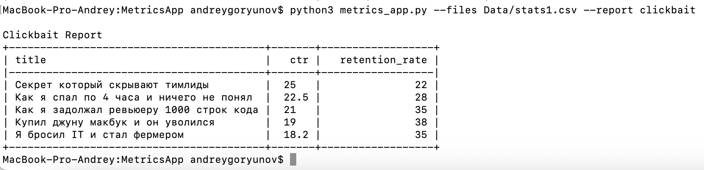
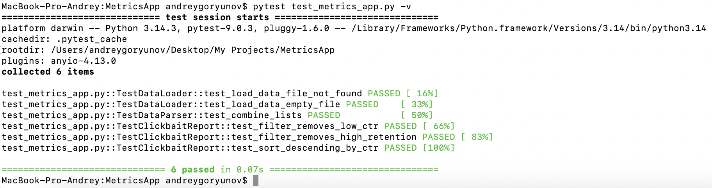

# MetricsApp

hh.ru - https://ulyanovsk.hh.ru/resume/f3eab237ff105fc7030039ed1f6f4861393876

# == Зависимости от библиотек ==

Необходимо установить:

- tabulate
- pytest

Стандартные библиотеки:

- csv
- argparse
- abc
- os
- tempfile

# == Запуск ==

Обязательно перейти в папку MetricsApp:

*cd MetricsApp*

Запуск файла через metrics_app.py:

Вариант по умолчанию (тестовые отчеты stats1 и stats2 будут взяты из папки Data, тип отчета будет clickbait):

*python3 metrics_app.py*

Вариант с несколькими своими входными метриками:

*python3 metrics_app.py --files Data/stats1.csv Data/stats2.csv Data/stats3.csv*

Вариант с указанием типа отчета:

*python3 metrics_app.py --files Data/stats1.csv Data/stats2.csv --report clickbait*

Вызвать помощь:

*python3 metrics_app.py --help*

Запуск тестов:

*pytest test_metrics_app.py -v*

# Скриншоты запуска / примеры работы

Запуск с данными по-умолчанию:

Запуск с несколькими файлами:

Запуск с выбором типа отчета:

Тесты:

